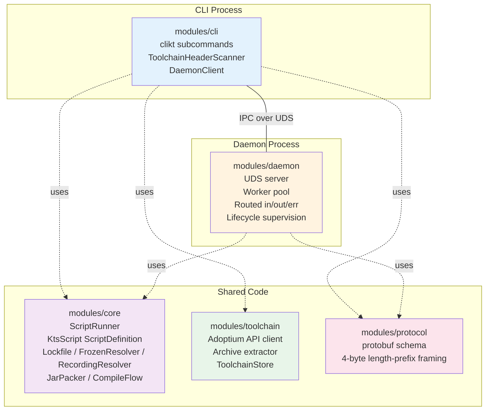

# Architecture

ktx is a Gradle multi-module project. Each module has a single responsibility and a clear public surface.



## Module responsibilities

### `modules/core`

The compilation and execution engine, plus the shared data model.

- **`KtsScript` ScriptDefinition** wires up `kotlin-main-kts`'s `MainKtsConfigurator` (for `@file:DependsOn` etc.) and adds ktx's own `@file:Toolchain` annotation type.
- **`ScriptRunner`** wraps `BasicJvmScriptingHost`. Points main-kts's compiled-script jar cache at `~/.cache/ktx/compiled/`. Supports optional resolver injection (`RecordingResolver` for lock, `FrozenResolver` for offline) via a ThreadLocal hook.
- **`Lockfile`** TOML data model and read/write.
- **`RecordingResolver` / `FrozenResolver`** wrap the standard `ExternalDependenciesResolver` interface to capture or replay dependency resolution.
- **`JarPacker` / `CompileFlow`** the `ktx compile` pipeline.

This module has no awareness of the CLI or daemon; it can be embedded as a library.

### `modules/cli`

The user-facing surface. clikt 5.x for argument parsing.

- One file per subcommand (`RunCommand`, `EvalCommand`, `LockCommand`, `AddCommand`, `CompileCommand`, `ToolchainCommand`, `DaemonCommand`).
- `ToolchainHeaderScanner` reads `@file:Toolchain(jdk = "...")` from a script's header **without** invoking the compiler — this is the chicken-and-egg trick that lets ktx pick the right JDK before compilation starts.
- `ToolchainDispatcher` re-execs ktx itself onto the requested JDK if needed.
- `DaemonClient` and `DaemonLifecycle` are the IPC client side.

### `modules/daemon`

The long-lived server.

- `Bootstrap` is the entry point.
- `DaemonServer` binds the Unix domain socket, runs the accept loop, dispatches requests to a `cachedThreadPool`.
- `RoutedOutputStream` / `RoutedInputStream` route per-thread `System.in/out/err` so concurrent requests don't cross-contaminate.
- Lifecycle supervisor handles idle timeout + heap watchdog.

### `modules/toolchain`

Adoptium JDK download and management.

- `AdoptiumClient` calls the v3 API, downloads with sha256 verification.
- `Archive` extracts tar.gz / zip (in-house ~150-line USTAR tar parser, no third-party tar library).
- `ToolchainStore` maintains the on-disk index at `~/.local/share/ktx/jdks/`.

### `modules/protocol`

Wire format only.

- `ktx.proto` — protobuf definitions.
- `Frames` — 4-byte big-endian length prefix + protobuf payload.
- `PROTOCOL_VERSION` constant. Daemon and CLI compare; mismatched versions trigger a graceful upgrade.

## Build-time vs. run-time JVM target

Every module compiles to **`JVM_17` bytecode** (configured in each `build.gradle.kts`), even though the build itself uses JDK 21. The reason: ktx itself can be re-execed onto JDK 17 by a script declaring `@file:Toolchain(jdk = "17")`. If ktx classes had class file version 65 (JDK 21), JDK 17 would refuse to load them with `UnsupportedClassVersionError`.

`JVM_17` is the floor for ktx; if you want to support older JDKs you'd have to drop further, with corresponding API loss (JDK 17 already lacks `java.net.UnixDomainSocketAddress`'s `Path` constructor signature on some patch versions, etc.).

## Why kotlin-main-kts under the hood

ktx is layered on top of [`kotlin-main-kts`](https://github.com/JetBrains/kotlin/tree/master/libraries/tools/kotlin-main-kts), JetBrains' supported scripting host. The November 2024 [State of Kotlin Scripting](https://blog.jetbrains.com/kotlin/2024/11/state-of-kotlin-scripting-2024/) confirmed `kotlin-main-kts` is the long-term-supported path. Building on top of it gives ktx:

- Battle-tested `@file:DependsOn` / `@file:Repository` / `@file:Import` semantics.
- Eclipse Aether-based Maven resolution.
- The compiled-script jar cache mechanism.
- IDE tooling that already understands `*.main.kts`.

ktx's job is not to reinvent any of that. It is to wrap it with a CLI / daemon / lockfile / toolchain layer that makes it ergonomic.

## Disk layout

```
~/.cache/ktx/
├── compiled/                          # main-kts compiled-script jars (sha256 keyed)
└── d/                                 # daemon directories
    ├── 5f350a9ddd42/                  # JDK 21 daemon
    │   ├── socket
    │   ├── pid
    │   ├── log
    │   ├── key.txt
    │   └── daemon.jsa                 # AppCDS archive
    └── 6ab41020796c/                  # JDK 17 daemon
        └── ...

~/.local/share/ktx/
└── jdks/                              # downloaded JDKs
    ├── temurin-17.0.19+10/
    ├── temurin-21.0.11+10/
    └── manifest.tsv

<your project>/
└── my-script.main.kts
└── my-script.main.kts.lock            # lockfile sits next to script
```

## Why XDG paths

ktx respects `$XDG_CACHE_HOME` and `$XDG_DATA_HOME` when set, and falls back to platform-appropriate defaults otherwise (`~/.cache`, `~/.local/share`). This is the standard behavior expected by uv, bun, modern Linux desktop tools, etc.
