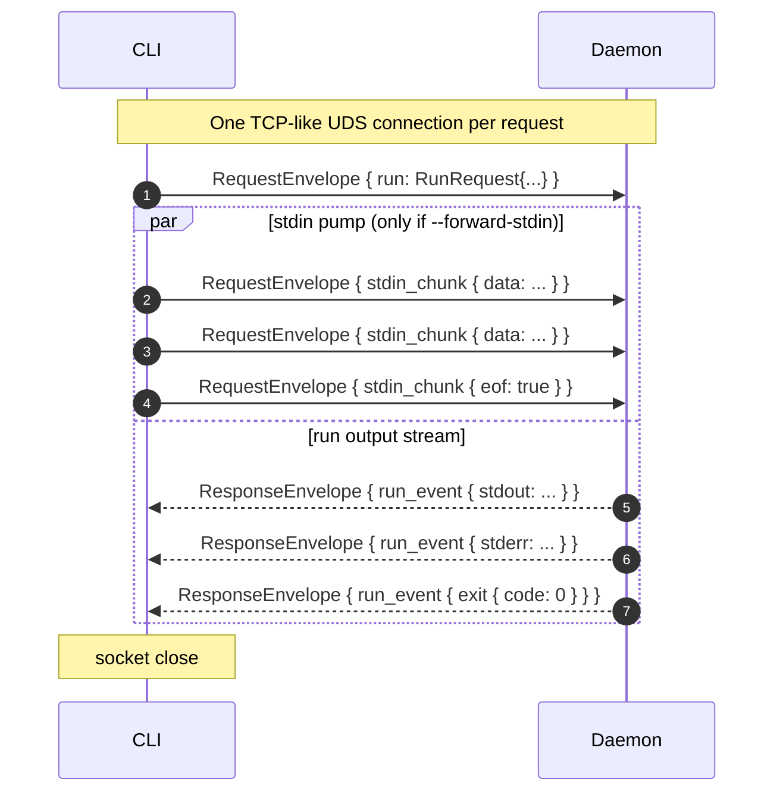
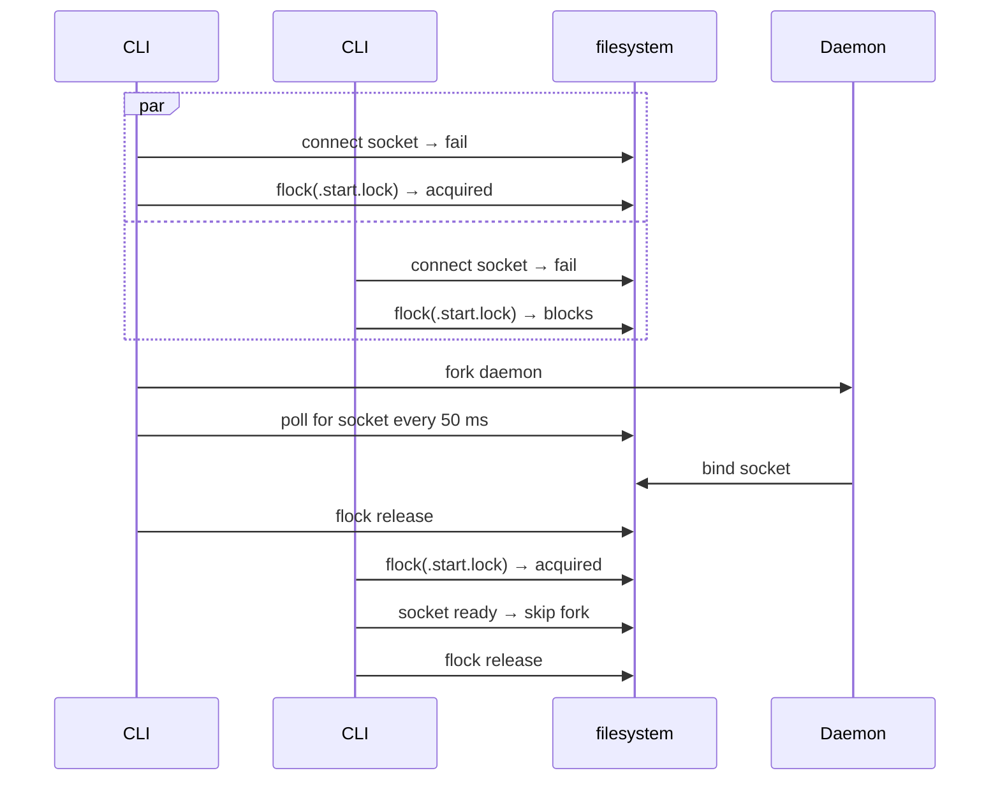

# Daemon Protocol

The CLI and daemon talk over a Unix domain socket using a length-prefixed protobuf framing.

## Wire format

Every frame is:

```
[ 4-byte big-endian length ][ length bytes of protobuf payload ]
```

There is a 32 MB cap per frame to bound malicious or malformed input.

`PROTOCOL_VERSION` is currently `1`. The CLI sends its version in the first frame; if the daemon does not support it, the daemon returns an `ErrorEvent` and the CLI kills the daemon and forks a new one matching the current ktx binary.

## Schema (protobuf v3)

```protobuf
message RequestEnvelope {
    uint32 protocol_version = 1;
    oneof body {
        RunRequest run = 10;
        ShutdownRequest shutdown = 11;
        StatusRequest status = 12;
        StdinChunk stdin_chunk = 13;     // follows a Run frame
    }
}

message ResponseEnvelope {
    oneof body {
        RunEvent run_event = 10;
        ShutdownResponse shutdown = 11;
        StatusResponse status = 12;
        ErrorEvent error = 99;
    }
}

message RunRequest {
    string script_path = 1;     // either path...
    string inline_source = 2;   // ...or inline source
    repeated string args = 3;
    string virtual_name = 4;    // diagnostic file name for inline mode
    string cwd = 5;             // client's cwd
    ResolverMode resolver_mode = 6;
    string lockfile_path = 7;   // FROZEN reads from, LOCK writes to
    bytes stdin = 8;            // legacy bytes; see StdinChunk for streaming
}

enum ResolverMode {
    NORMAL = 0;
    FROZEN = 1;
    LOCK = 2;
}

message RunEvent {
    oneof kind {
        bytes stdout = 1;
        bytes stderr = 2;
        ExitEvent exit = 3;
    }
}

message ExitEvent { int32 exit_code = 1; }

message StdinChunk {
    bytes data = 1;
    bool eof = 2;
}
```

## Run request flow



The daemon spawns one worker thread per connection. The worker:

1. Reads the first `RequestEnvelope` (the `RunRequest`).
2. Spawns a stdin-pump thread that reads subsequent `StdinChunk` frames and writes them to a `PipedOutputStream`.
3. Binds the routed `System.in/out/err` to this connection's pipes.
4. Calls `ScriptRunner.run(...)`. The script's `println` and `readLine` go to the right pipes.
5. After the script returns, sends one final `RunEvent.exit{code}` and closes.

## Why per-request flock

Multiple CLI invocations may race to fork the daemon if the socket is dead. Without coordination, all of them succeed `ProcessBuilder.start()` and you get N daemons fighting for the socket. ktx uses an advisory file lock (`.start.lock`) inside the daemon directory:



Both CLIs end up using the same daemon. No races, no orphans.

## Routing keys

The daemon directory is keyed by `(jdkMajor, protocolVersion)`:

```
sha256("jdk=21;protocol=v1") → 5f350a9ddd42...   (use first 12 hex chars)
sha256("jdk=17;protocol=v1") → 6ab41020796c...
```

Different scripts (one wanting JDK 17, another wanting JDK 21) end up routed to **different daemons**, each running on the appropriate JVM. There's no inter-daemon coordination — each is a fully independent server.

The 12-hex-char prefix keeps the UDS socket path under macOS' 104-byte `sun_path` limit even when XDG paths are deeply nested.

## Why not gRPC

- gRPC adds ~10 MB to ktx's distribution.
- gRPC requires a long-lived channel; we want short-lived per-request connections that close cleanly.
- Length-prefix + protobuf is ~30 lines of code, traceable, debuggable.

## Why not unix file descriptors

The Java standard library's `java.net.UnixDomainSocketAddress` does not expose `SCM_RIGHTS`-based file-descriptor passing. We could JNI it, but:

- Gradle's daemon and Kotlin's compiler daemon both use byte-stream forwarding (no FD passing) and that has worked fine for years.
- Gateway-style stdout/stderr forwarding (sink → frame → emit) is simpler than negotiating file descriptors and is what `ktx` does.

## Versioning

When a future change is wire-incompatible (e.g. moving from length-prefix to a multi-stream multiplex), `PROTOCOL_VERSION` will bump to 2. CLI/daemon compare on connect; on mismatch the CLI sends `ShutdownRequest` to the old daemon and forks a new one. Users see at most one extra cold start.
