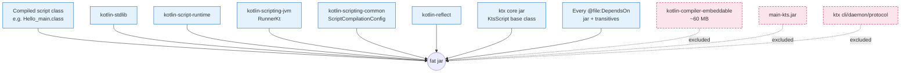
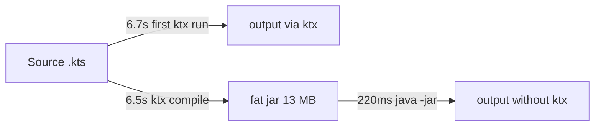

# Compiling Scripts

`ktx compile` packages a script into a standalone fat jar that runs on plain JRE 17+. End users do not need ktx, do not need a Kotlin compiler, do not need any extra setup.

## Quick example

```bash
$ ktx compile samples/hello.main.kts
[INFO] compile /path/to/samples/hello.main.kts
[INFO] merge: 3 KB script artifact + 0 user deps + 4 Kotlin runtime jars + ktx core
[INFO] pack done: samples/hello.jar (7501 entries)
Output: samples/hello.jar (11288 KB)
Run:    java -jar samples/hello.jar [args...]

$ java -jar samples/hello.jar foo bar
hello from main.kts
args (2):
  [0] foo
  [1] bar
```

## What's in the jar

The merged jar contains exactly the classes needed at runtime:



This separation is what brings the size down to **11–13 MB** instead of ktx's full 80 MB install.

## Sizes and startup

| Script | Output size | `java -jar` startup |
| --- | ---: | ---: |
| `hello.main.kts` (no deps) | 11 MB | ~180 ms |
| `jackson.main.kts` (`jackson-databind` + 3 transitives) | 13 MB | ~220 ms |

vs. `ktx run` first invocation of `jackson.main.kts`: 6.7 s.



The compile cost lands once, on your build machine. End users pay only the `java -jar` cost.

## Side effects

`ktx compile` runs the script body once during compilation, because dependency resolution in `kotlin-main-kts` is interleaved with class generation. If your script has side effects you don't want to fire during build (HTTP calls, file writes, etc.), wrap them in a `main` function or guard them with an explicit "compile mode" flag.

```kotlin
// avoid: this network call fires during ktx compile
val data = HttpClient().get("https://api.example.com").body<String>()
println(data)

// prefer: keep side effects under main
fun main() {
    val data = HttpClient().get("https://api.example.com").body<String>()
    println(data)
}
main()
```

Future versions may add a `--no-execute` flag that skips evaluation entirely; tracked in the [Phase 3 TODO](https://github.com/gaojunran/ktx/blob/main/reports/phase-3-todo.md).

## What gets included automatically

`ktx compile` analyzes your script's `@file:DependsOn` and `@file:Repository` declarations the same way `ktx run` does. Every transitive jar that resolution produces is packaged.

Resources (non-class files in jars) are also packaged: `META-INF/services/*` files are concatenated for ServiceLoader compatibility, `module-info.class` files are dropped to keep the jar usable on the classpath.

## What is not included

- **`kotlin-compiler-embeddable.jar`** (~60 MB). The script is already compiled; the runtime needs no compiler.
- **`main-kts.jar`**. Its sole purpose is to drive resolution and compilation; both happen at compile time.
- **ktx's CLI / daemon / protocol modules**.

This is what gives `ktx compile` output its 1/6 size advantage.

## When to use `ktx compile`

- **Distribute internal tools.** Hand a coworker a 13 MB jar instead of asking them to install ktx and Kotlin.
- **Build artifacts in CI.** Embed `ktx compile` in a build pipeline; ship the jar with your release.
- **One-off scripts on production.** Schedule a cron job that runs `java -jar your-script.jar`; no ktx footprint on the host.

## When not to use it

- **Active development.** Use `ktx run --daemon` for the dev loop; recompile-to-jar every iteration is overkill.
- **Scripts that change every run.** `ktx compile` does not run a daemon; it shells out a fresh compiler per invocation.

## Self-contained: zero Java required

`--self-contained` wraps the fat jar in a directory that ships its own minimal JRE. End users do not need Java installed at all — they extract the directory and run `bin/<name>`.

```bash
$ ktx compile samples/hello.main.kts --self-contained -o ./hello-app
[INFO] compile /path/to/samples/hello.main.kts
[INFO] modules: detected=[java.base, java.logging, ...], final=[java.base, ...]
artifact: ./hello-app/  (~42 MB)
layout:
  bin/hello-app    launcher
  lib/app.jar      compiled script (~11 MB)
  runtime/         embedded JRE (~31 MB)
run with: ./hello-app/bin/hello-app [args...]

$ ./hello-app/bin/hello-app foo bar
hello from main.kts
args (2):
  [0] foo
  [1] bar
```

Under the hood:

1. Build the fat jar (same as the default path above).
2. `jdeps --print-module-deps` reads the fat jar and reports the JDK modules it actually uses.
3. `jlink --add-modules <list> --compress=2 --strip-debug` produces a minimal runtime under `runtime/`.
4. A small launcher script (`/bin/sh` on macOS / Linux, `.bat` on Windows) chains the bundled `java` to `lib/app.jar`.

A few extra modules — `jdk.unsupported`, `java.naming`, `java.logging` — are unioned in unconditionally because `jdeps` cannot trace classes loaded reflectively, and they are cheap to keep.

### Trade-offs

- **Size**: ~40 MB for a no-deps script, ~60 MB once a database driver or large JSON library lands. About 4× the fat jar but absolutely flat for the end user.
- **Host platform only**: `jlink` cannot cross-compile. To distribute to macOS, Linux, and Windows, run `ktx compile --self-contained` once per platform.
- **Build host needs a JDK**: `jdeps` and `jlink` ship with the JDK, not the JRE. ktx will exit with a clear error if either is missing.

### When to use it

- Tools for non-developer audiences who balk at "first install Java".
- Locked-down hosts where you cannot install or update a system JRE.
- Reproducible artifacts: the JRE version is pinned to whatever JDK ran `ktx compile`.

## Self-contained: zero Java required

`--self-contained` wraps the fat jar in a directory that ships its own minimal JRE. End users do not need Java installed at all — they extract the directory and run `bin/<name>`.

```bash
$ ktx compile samples/hello.main.kts --self-contained -o ./hello-app
[INFO] compile /path/to/samples/hello.main.kts
[INFO] modules: detected=[java.base, java.logging, ...], final=[java.base, ...]
artifact: ./hello-app/  (~42 MB)
layout:
  bin/hello-app    launcher
  lib/app.jar      compiled script (~11 MB)
  runtime/         embedded JRE (~31 MB)
run with: ./hello-app/bin/hello-app [args...]

$ ./hello-app/bin/hello-app foo bar
hello from main.kts
args (2):
  [0] foo
  [1] bar
```

Under the hood:

1. Build the fat jar (same as the default path above).
2. `jdeps --print-module-deps` reads the fat jar and reports the JDK modules it actually uses.
3. `jlink --add-modules <list> --compress=2 --strip-debug` produces a minimal runtime under `runtime/`.
4. A small launcher script (`/bin/sh` on macOS / Linux, `.bat` on Windows) chains the bundled `java` to `lib/app.jar`.

A few extra modules — `jdk.unsupported`, `java.naming`, `java.logging` — are unioned in unconditionally because `jdeps` cannot trace classes loaded reflectively, and they are cheap to keep.

### Trade-offs

- **Size**: ~40 MB for a no-deps script, ~60 MB once a database driver or large JSON library lands. About 4× the fat jar but absolutely flat for the end user.
- **Host platform only**: `jlink` cannot cross-compile. To distribute to macOS, Linux, and Windows, run `ktx compile --self-contained` once per platform.
- **Build host needs a JDK**: `jdeps` and `jlink` ship with the JDK, not the JRE. ktx will exit with a clear error if either is missing.

### When to use it

- Tools for non-developer audiences who balk at "first install Java".
- Locked-down hosts where you cannot install or update a system JRE.
- Reproducible artifacts: the JRE version is pinned to whatever JDK ran `ktx compile`.

## Further reduction (planned)

| Technique | Phase | Expected size |
| --- | --- | --- |
| Fat jar (Phase 2.4) | shipped | 13 MB |
| `--self-contained` (Phase 3.1) | shipped | 40-60 MB total, zero user deps |
| ProGuard / R8 reflect-only keeps | Phase 3+ | ~10 MB |
| `jpackage` installer (.dmg / .deb / .exe) | Phase 3+ | wraps `--self-contained` |
| GraalVM native image | Phase 3.2 | ~10 MB native binary, ~10 ms startup |

The `--native` flag and `jpackage` installer mode are tracked in the [Phase 3 TODO](https://github.com/gaojunran/ktx/blob/main/reports/phase-3-todo.md).
