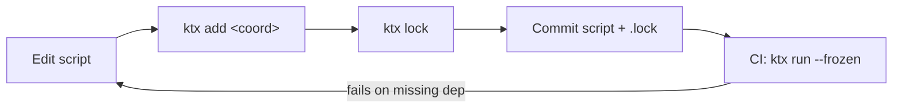

# Lockfiles

ktx lockfiles pin every transitive jar a script resolves to, so the same script produces the same dependency tree on every machine, every time.

## What a lockfile looks like

```toml
# Auto-generated by ktx. Do not edit by hand.
schema = 1

[script]
hash = "74f954cf9d7ba59ade2e2069b829acc4ceca6671c6e3254fcdaae629b0498010"

[[directs]]
coordinates = "com.fasterxml.jackson.core:jackson-databind:2.18.0"
files = [
  "com/fasterxml/jackson/core/jackson-annotations/2.18.0/jackson-annotations-2.18.0.jar",
  "com/fasterxml/jackson/core/jackson-core/2.18.0/jackson-core-2.18.0.jar",
  "com/fasterxml/jackson/core/jackson-databind/2.18.0/jackson-databind-2.18.0.jar",
]
```

- `schema` is the lockfile-format version (currently `1`).
- `script.hash` is sha256 of the script source. Used to detect drift.
- Each `[[directs]]` table corresponds to one top-level `@file:DependsOn(...)` declaration. `files` lists every jar — direct and transitive — that resolution produced, expressed as paths relative to `~/.m2/repository/`.

The relative-path format makes lockfiles **portable across machines**. As long as the consuming machine has the same jars under its local Maven repository (which `ktx run --frozen` checks for), the script behaves identically.

## Workflow

### Generate

```bash
ktx lock my-script.main.kts
```

This resolves dependencies, writes `my-script.main.kts.lock`, and **does not run the script body**. Side-effect-free.

### Run frozen (CI)

```bash
ktx run --frozen my-script.main.kts
```

This reads the lockfile, resolves every coordinate to a local file, **never touches the network**. If a jar listed in the lockfile is missing locally, you get a clear error.

### Refresh after edits

```bash
ktx run --lock my-script.main.kts
```

Resolves online, refreshes the lockfile, then runs the script. Equivalent to `ktx lock` followed by `ktx run`, in one shot.

## Recommended workflow



1. Add a dependency: `ktx add com.example:foo:1.0 my.kts` (writes `@file:DependsOn` and refreshes lockfile).
2. Commit `my.kts` **and** `my.kts.lock` to your repo.
3. CI runs `ktx run --frozen my.kts` — no network, no surprises.

## Performance impact

Compared on `samples/jackson.main.kts` over various scenarios:

| Scenario | Time |
| --- | ---: |
| First run, no caches (online resolution + compile) | 6.7 s |
| Warm: same script, compile cache hit, no `--frozen` | 280 ms |
| Warm: same script, compile cache hit, `--frozen` | 300 ms |
| New machine: lockfile present, compile cache cleared, online | 6.7 s |
| New machine: lockfile present, compile cache cleared, **`--frozen`** | **1.6 s** |
| Daemon warm + `--frozen` | **170 ms** |

The new-machine `--frozen` row is the CI win: **4× faster** than online resolution, no network required.

## Caveats

- **Local Maven repo coupling.** The frozen path looks up jars in `~/.m2/repository/`. If your environment uses a different layout (e.g. only Gradle's cache at `~/.gradle/caches/`), `--frozen` will fail. Pre-populate `~/.m2` via `mvn dependency:get` or run a non-frozen `ktx run` once on the target machine to seed it.
- **Script-hash drift detection is informational, not enforced.** ktx records the hash but currently does not refuse to run a frozen script whose source has changed. The intent is that you treat the lockfile as a build artifact and refresh it whenever the script changes.

## Implementation

`--frozen` swaps the default `MavenDependenciesResolver` (which goes to Aether) for a `FrozenResolver` that reads the lockfile and returns local files only. The replacement happens through the same `ExternalDependenciesResolver` interface that `kotlin-main-kts` already uses, so the rest of the pipeline (`MainKtsConfigurator`, the compilation cache, etc.) is untouched.

`ktx lock` wraps the script source so its body is replaced with `Unit` (preserves header annotations, drops side effects), then runs through ktx with a `RecordingResolver` that captures every resolution result. The captured results are written to the lockfile.
