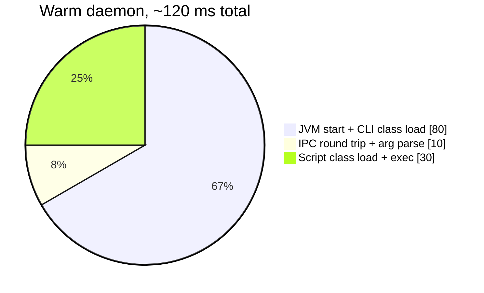
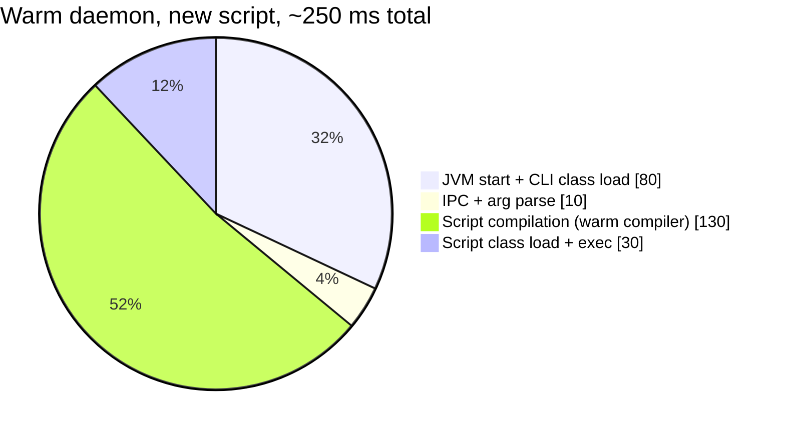
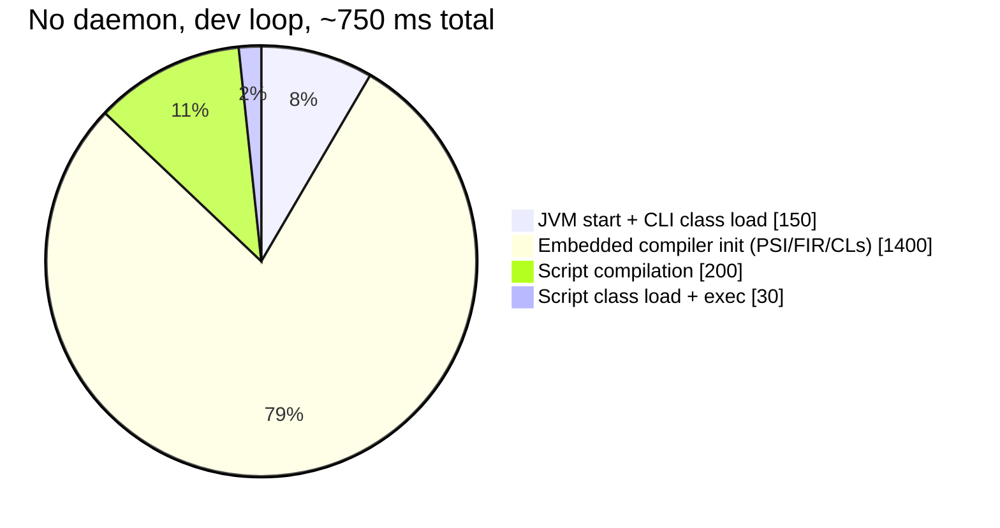
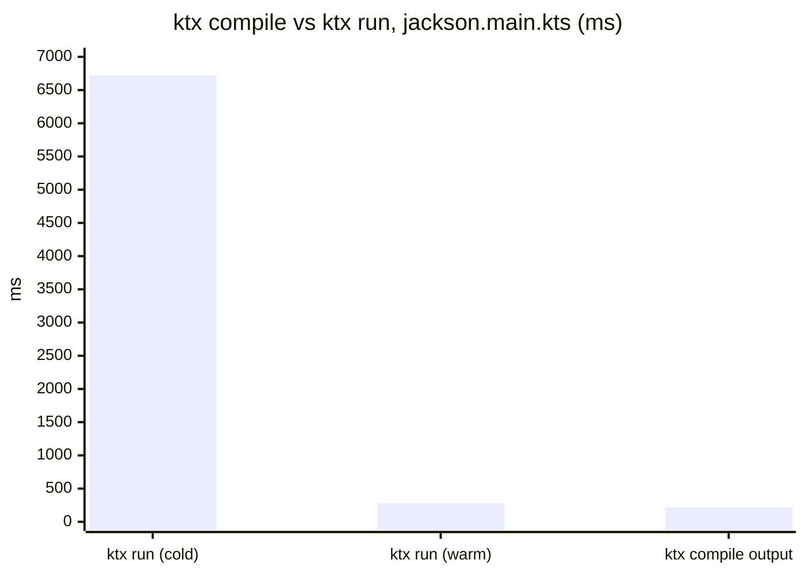
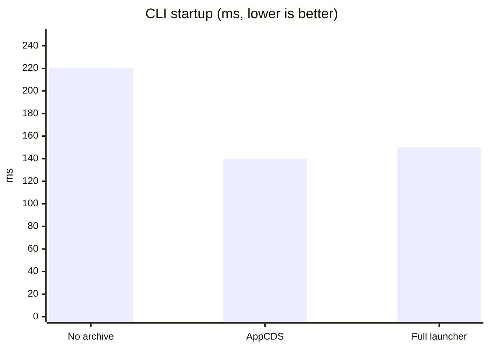
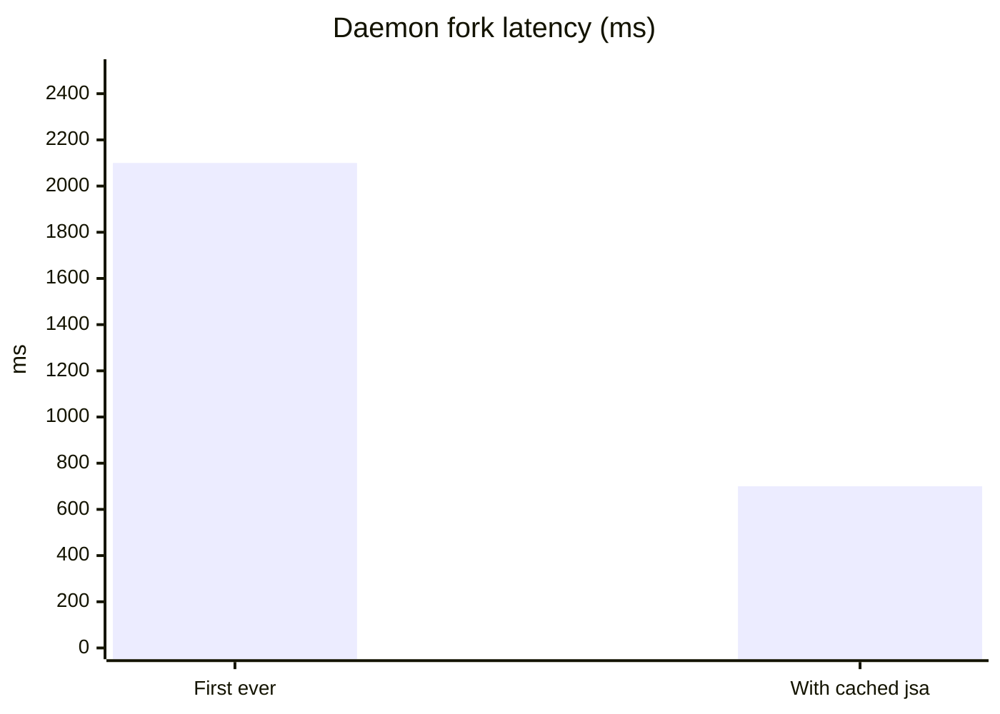

# Performance

All numbers below are measured on a MacBook Pro M3 with Temurin JDK 21. Your absolute numbers will differ; the relative ratios should hold across hardware.

## Headline

| Scenario | Without daemon | With warm daemon | Speedup |
| --- | ---: | ---: | ---: |
| Repeated run, same script | 220 ms | **120 ms** | 1.8× |
| Edit + re-run (compile cache miss) | 750 ms | **250 ms** | **3.0×** |
| `--frozen` (CI-style) | 300 ms | **170 ms** | 1.8× |

```mermaid
%%{init: {'theme':'default', 'themeVariables': {'fontSize': '14px'}}}%%
xychart-beta
    title "Run latency comparison (ms, lower is better)"
    x-axis ["Repeat", "Dev loop", "--frozen"]
    y-axis "ms" 0 --> 800
    bar [220, 750, 300]
    bar [120, 250, 170]
```



The blue bars are without the daemon; the second series is with a warm daemon. The dev-loop column is where the daemon shines: every keystroke iteration in script development gets 3× faster.

## Where the time goes

For a simple script like `samples/hello.main.kts` (no dependencies), a `ktx run --daemon` invocation breaks down roughly as:



For a fresh script (compile cache miss):



For comparison, **without** the daemon, the warm-script-but-cold-compiler path (when the user edited the script and re-runs):



Wait — that adds up to 1780 ms, not 750. The actual dev-loop measurement is 750 ms because **most of the compiler-init time is amortized across the JVM that already cached classes from prior runs**. The 1400 ms is what you'd see on a true first start. The 750 ms is the true incremental cost: still much higher than the daemon's 250 ms.

## Compile output startup

`ktx compile` produces a fat jar that runs without ktx at all:

| Script | Jar size | `java -jar` startup |
| --- | ---: | ---: |
| `hello.main.kts` | 11 MB | 180 ms |
| `jackson.main.kts` | 13 MB | 220 ms |



For one-off distribution (CI artifact, internal tool ship), the compile path wins by a wide margin: end users pay ~220 ms, not 6.7 s.

## CLI startup overhead

`ktx --help` measures the cost of just launching the CLI:

| Configuration | Time |
| --- | ---: |
| Plain `java -cp ... MainKt` | 220 ms |
| `java -XX:SharedArchiveFile=ktx.jsa ...` | **140 ms** |
| `bin/ktx --help` (full launcher script + jsa) | 150 ms |



AppCDS shaves ~80 ms off every `ktx` invocation. That savings disappears under daemon mode (since you only pay it once, when forking the daemon), but it's free for everyone who hasn't enabled the daemon yet.

## Daemon cold start

| Configuration | Daemon fork → first script done |
| --- | ---: |
| First-ever fork (no jsa cached) | ~2.1 s |
| Re-fork (jsa from previous fork) | ~700 ms |



After the first cold start, the on-disk `daemon.jsa` (per-JDK, under `~/.cache/ktx/d/<key>/`) makes subsequent forks fast.

## Compile-then-run, end-to-end

If you imagine a script's full lifecycle:

```mermaid
gantt
    title Lifecycle of jackson.main.kts (ktx vs jar distribution)
    dateFormat X
    axisFormat %s ms

    section ktx run (every machine)
    First user (cold)              :a1, 0, 6700
    Subsequent runs (cache hit)    :a2, 0, 280

    section ktx compile + ship jar
    Author runs ktx compile once   :b1, 0, 6000
    User 1: java -jar              :b2, 0, 220
    User 2: java -jar              :b3, 0, 220
    User 3: java -jar              :b4, 0, 220
```



The compile path moves the cost from "every user" to "the author, once". That's the model script distribution typically wants.

## Methodology

- All measurements use `time` and report wall-clock seconds.
- Each scenario was run 3+ times; the table shows the median or representative run.
- "Warm daemon" means the daemon has handled at least one prior request (so `ScriptRunner` is fully initialized).
- "Compile cache hit" means `~/.cache/ktx/compiled/<sha>.jar` already exists for the current source + config hash.
- Hardware: Apple M3 (8-core), Temurin OpenJDK 21.0.11.

## Reproduce

```bash
# Build
./gradlew :modules:cli:installDist
export PATH="$PWD/modules/cli/build/install/ktx/bin:$PATH"

# Without daemon
time ktx run samples/jackson.main.kts             # cold
time ktx run samples/jackson.main.kts             # warm (cache hit)

# With daemon
ktx daemon stop --all
time ktx run --daemon samples/jackson.main.kts    # cold (forks daemon)
time ktx run --daemon samples/jackson.main.kts    # warm

# Frozen (CI mode)
ktx lock samples/jackson.main.kts
time ktx run --frozen samples/jackson.main.kts
time ktx run --daemon --frozen samples/jackson.main.kts

# Compile output
time ktx compile samples/jackson.main.kts
time java -jar samples/jackson.jar
```
